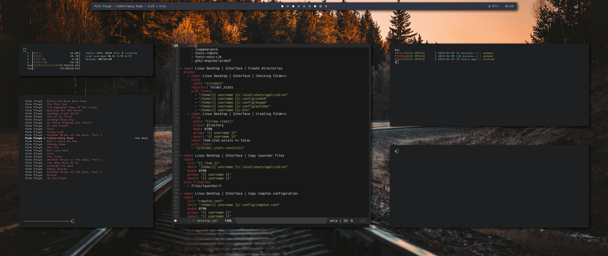

# Linux Desktop container role

Creates a linux development environment with the tools that I use. It will look
like it when you finish running it.



# Install

You can install directly with:

`ansible-galaxy install opsxcq.linux_desktop`

Or add to your `requirements.yml`

# Variables

 - `username` - Username that will have the configuration files installed.
 - `gpg_hash` - The respective hash of your GPG key.
 - `git_name` - The name that you want to be displayed in your commits
 - `git_email` - Your email
 - `extra_git_repos` - A list of `{repo:... dest:...}` of additional git
   repositories to clone.
 
# Notes

- Save your wallpaper to `${HOME}/.wallpaper.jpg`
- You need to recompile termite and put it in `${HOME}/.bin`
- You need to recompile polybar and put it somewhere in the `$PATH`.
- You must run as **root**

## Requirements

This role is meant to be run in a **Debian Linux** system.

## Example Playbook


```yaml
- name: Apply desktop configuration
  hosts: desktop
  vars:
    username: "opsxcq"
    git_name: "OPSXCQ"
    git_email: "opsxcq@strm.sh"
    gpg_hash: "66ED4A9A4D70D36FE48196419AD730FE9CDE5661"
  roles:
    - opsxcq.linux_desktop
```
